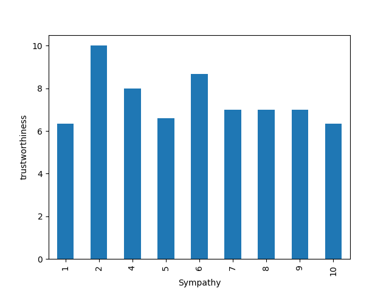
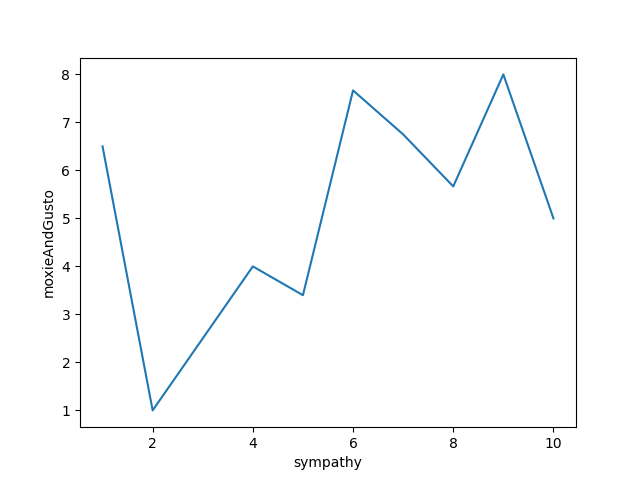
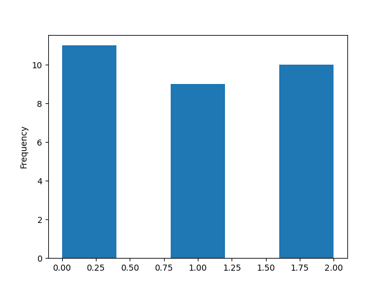

# Project 3 -  Student Submission

## Project Info
- **Project Title:** Fishman data analysis
- **Your Name:** Benedict Putman
- **Date:** 10/8/2025

---

## Survey Information
- **Survey Topic:** The surver is about the fishman and how people feel about him
- **Survey Link:** [Click here to view survey](https://example.com)
- **Number of Responses:** 10 real, 20 fake

---

## Survey Questions
List the questions you asked in your survey and their type:

1. What is your name? (short answer)
2. How worried are you about the fishman (1-10)
3. How sympathetic are you with the fishman (1-10)
4. How much moxie and gusto do you have (1-10)
5. How many fishmen are in the room with you (0-2)
6. How much squimble and gwibble do you have (1-10)
7. How trustworthy are you (1-10)
8. What is your Ph level
---

## Data Overview
- **Link to Raw Data File (CSV):** [Download here](dataFrame2.csv)
- **Number of Columns:** 8
- **Number of Rows:** 30
- **Any Cleaning Steps Taken:** Not much cleaning had to be done. I shortened the names of the data, and also redacted names to be first initial+last name. 

---

## Charts Created
List each chart you made, its type, and what it shows. Add a link or embed an image if possible.

| # | Chart Title | Chart Type (Bar, Histogram, Scatter, etc.) | Brief Description | Link or Image |
|---|-------------|-------------------------------------------|-------------------|---------------|
| 1 | Trustowrthiness by sympathy | Bar Chart | Shows average trustworthiness level per sympathy level |  |
| 2 | moxie/gusto by sympathy | Line chart | Shows average moxie and gusto level per sympathy level |  |
| 3 | num students by num fishmen | Histogram | Shows How many children think x number of fishmen are in the room with them |  |

---

## Data Analysis & Insights
Write a short analysis of your findings. Include at least one interesting insight from your data.

We found that overall, students who had a sympathy level of 2 were both the most trustworthy and had the least gusto. We also found that those who had a sympathy level of 7, 8, or 9 had a similar level of trustworthiness.

---

## Reflection
Answer briefly:
- What went well in your project?
- What was the most challenging part?
- If you had more time, what would you do differently?

---

### Submission Checklist
- [ ] Link to survey included
- [ ] Questions listed
- [ ] Raw data file attached or linked
- [ ] 3+ charts created and linked/embedded
- [ ] Data analysis section filled in